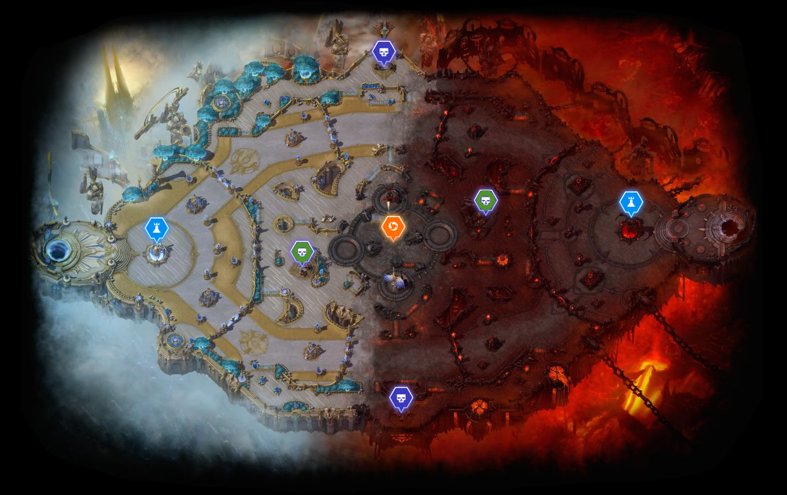
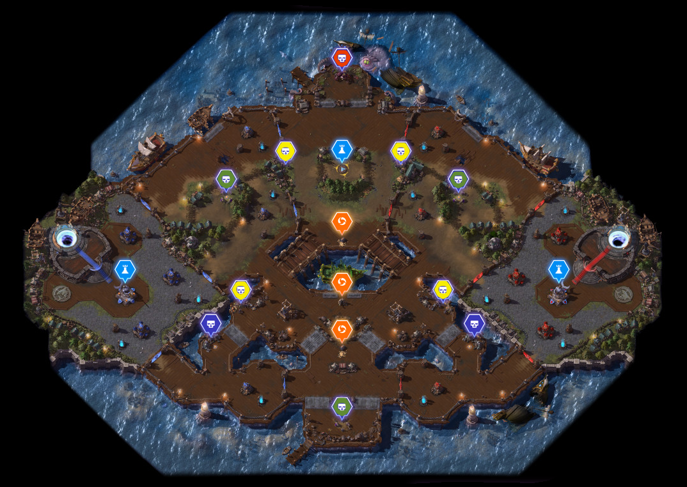
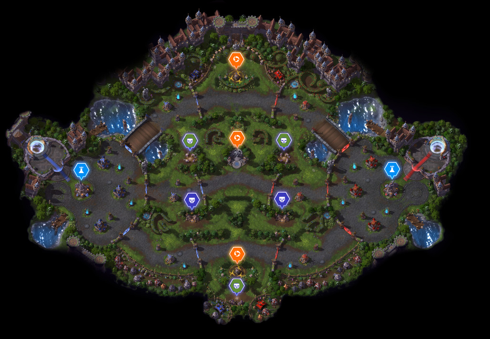
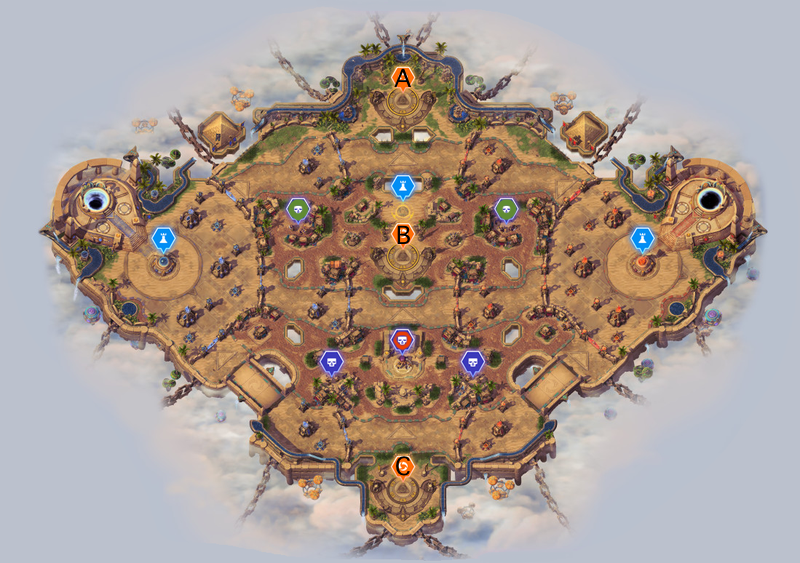

# Heroes of the Storm Maps
Dieser Guide soll helfen eine gute Übersicht über den Zeitablauf, sowie weiteren wichtigen Informationen der verschiedenen Karten von Heroes of the Storm zu bekommen.  
Da das Spiel von vielen in der Originalsprache gespielt wird, werden hier sowohl die Englischen als auch die Deutschen Begriffe benutzt. Zur Vereinfachung werden die zwei folgenden Begriffe nur im englischen verwendet:

- _Initial spawn time_: Die Zeit in der das Ereignis das erste mal stattfindet
- _Respawn time_: Die Zeit in der das Ereignis erneut auftritt

### Mercenaries Camp / Söldner Camp

| Symbol |Camp | Initial spawn time | Respawn time|
|--------|-----|-------------------|-------------|
|</img>|Siege Camp|
2:00
|
3:00
|
|</img>|Bruiser Camp|
2:00
|
4:00
|
|</img>|Boss Camp|
3:00
|
5:00
|

## Map-Übersicht

**Letztes Update**:
- _Patch_: 12.1.36536
- _Datum_: 04.08.2015

## Symbole

| Symbol | Bedeutung|| Symbol | Bedeutung|
|--------|----------||--------|----------|
|</img>|Siege Camp||</img>|Doubloon Camp|
|</img>|Bruisder Camp||</img>|Base / Watchtower|
|</img>|Boss Camp||</img>|Event (Ereignis)|

### Battlefield of Eternity (Schlachtfeld der Unendlichkeit)

  <a href="http://us.battle.net/heroes/en/battlegrounds/battlefield-of-eternity/" target="_blank">
    </img>
  </a>

**Immortals (Unsterbliche)**:
- Die ersten Immortals erscheinen nach 
1:45

- Respawn time: 
1:40
 bis 
1:50

- Immortals fügen sich gegenseitig 
keinen
 Schaden zu
- Wenn einer der beiden nur noch die Hälfte des Lebens hat, werden die Positionen der beiden Immortals verändert
- Wenn die beiden das erste mal im Spiel Positionen tauschen, so ist der Himmlische Immortal immer rechts und vice versa

**Camps**:
- Die Camps auf dieser Map sind unterschiedlich vom Design und Gameplay zu den anderen Maps
-  Siegecamps haben nun drei statt zwei Weitkämpfern, die allerdings dafür keinen Flächenschaden mehr machen
-  Bruisercamps haben einen Schamanen der Hunde wiederbelebt, wenn diese umgebracht werden. Daher immer die Schamanen zuerst töten

### Blackheart's Bay (Schwarzherzbucht)

  <a href="http://us.battle.net/heroes/en/battlegrounds/blackhearts-bay/" target="_blank">
    </img>
  </a>

Bei jedem Camp bekommt man **zwei** Dublonen. Zusätzlich gibt es auf dieser Map zwei Dublonen Camps bei denen man Extra Dublonen sammeln kann.

</img>**Doubloon Camp (Dublonen Camp)**:
- Initial spawn time: 
2:00

- Respawn time: 
2:30

Es erscheinen zwei Truhen südlich und nördlich vom Schiff die jeweils fünf Dublonen haben.

**Chests (Schatztruhen)**:
- Initial spawn time: 
0:50

- Respawn time: 
2:30
 bis 
3:15
 nachdem die letzte Truhe zerstört wurde. Der genau Zeitpunkt ist zufällig

**Blackheart**:
- Erscheint nach 
1:15
 und bleibt dauerhaft, außer beim beschiessen der Gegner
- Der erste Angriff kostet _10_ Dublonen, alle darauffolgenden immer _2_ mehr
- Es werden 12 Schüsse abgegeben

### Cursed Hollow (Verfluchtes Tal)

  <a href="http://us.battle.net/heroes/en/battlegrounds/cursed-hollow/" target="_blank">
    </img>
  </a>

**Tributes (Tribute)**:
- Der Zeitpunkt in dem das Tribut erscheint ist zufällig in einem bestimmten Intervall
- Falls vor dem Tribut der Fluch _nicht_ aktiv war: 
0:50
 bis 
1:40

- Falls vor dem Tribut der Fluch aktiv war: 
3:00
 bis 
4:00

  <a href="http://us.battle.net/heroes/en/battlegrounds/cursed-hollow/" target="_blank">
    </img>
  </a>

**Regeln für Reihenfolge der Tribute**:  
Tribute kommen immer in Sets von Drei:
- (1) Die Tribute können nicht am selben Ort erscheinen
- (2) Alle drei Tribute können nicht auf der selben Horizontalen Linie erscheinen
- (3) Jedes Tribut erscheint auf einer anderen vertikalen Linie

**Beispiel**:
- Tribut **A** und **B** erscheinen zuerst
- Durch Regel 2 muss das Tribute bei **D**, **E** oder **F** sein
- Durch Regel 3 muss das Tribut bei **C** oder **F** sein
- Dadurch kann das Tribut nur bei **F** erscheinen

**Wichtig**: Für das zweite Tribut im Spiel gilt diese Regel _nicht_

### Dragon Shire (Drachengärten)

  <a href="http://us.battle.net/heroes/en/battlegrounds/dragon-shire/" target="_blank">
    </img>
  </a>

**Shrines (Schreine)**:
- Die Schreine öffnen das erste mal: 
1:15

- Die Schreine öffnen erneut: 
2:00
 nachdem der Drache getötet wurde

**Dragon (Drache)**:
- Schaden an Helden: 
140
 beim ersten Drachen. Jede Aktivierung erhöht den Schaden
- Schaden an Gebäuden: 
280
 beim ersten Drachen. Jede Aktivierung erhöht den Schaden
- Dauer: 
0:50
 beim ersten Drachen. Jede Aktivierung erhöht die Dauer des Drachen

**Camp**:
- Während der Drache aktiv ist, verschwinden die Camps

**Tipps**:
- Während des ersten Drachen sollte man weiterhin alle drei Lanes besetzen für die zusätzliche Erfahrung

### Garden of Terror (Garten der Ängste)

  <a href="http://us.battle.net/heroes/en/battlegrounds/garden-of-terror/" target="_blank">
    </img>
  </a>

**Nights**:
- Erste Nacht startet: 
1:30

- Nächste Nacht startet: 
3:20
 nachdem die letzte Pflanze getötet wurde
- Jede Nacht gibt es insgesamt 180 Samen zu sammeln, vier mal 20 bei und zwei mal 50

**Tipp**:
- In der Anzeige wo die Samen gezählt werden, wird ein Samen angezeigt. Ist dieser geöffnet, gibt es diese Nacht noch genug Samen zu sammeln, ansonsten ist das Bild verschlossen

### Haunted Mines (Geisterminen)

  <a href="http://us.battle.net/heroes/en/battlegrounds/haunted-mines/" target="_blank">
    </img>
  </a>

  <a href="http://us.battle.net/heroes/en/battlegrounds/haunted-mines/" target="_blank">
    </img>
  </a>

**Mine**:
- Die Mine wird geöffnet: 
2:00

- Respawn time: 
2:00
 nachdem der Golem getötet wurde
- Die mittleren Zwei Camps in der Mine sind am wertvollsten
- Insgesamt gibt es 35 Skelette die jeweils zwei Schädel hinterlassen

**Tipps**:
- Wenn der gegnerische Golem bei der erste Base ist, sollte man sein eigenes Siege Camp machen, da die Söldner dann bei der Verteidigung gegen den Golem helfen

### Sky Temple (Tempel des Himmels)

  <a href="http://us.battle.net/heroes/en/battlegrounds/sky-temple/" target="_blank">
    </img>
  </a>

**Tempel-Zeiten**:
- Erste Aktivierung: 
1:30

- Nächste Aktivierung: 
2:00
 nachdem der letzte Tempel geschossen hat
- Dauer des Beschusses: 
0:35

**Reihenfolge**:
- Erste Aktivierung: Tempel **A** und **B**
- Zweite Aktivierung: Tempel **C**
- Dritte Aktivierung: Tempel **C** und entweder **A** oder **B**
- Nach der dritten Aktivierung ist die Anzahl der Tempel so wie der Standort zufällig
- **Vor** der _sechsten_ Aktivierung kann es keine drei Tempel gleichzeitig geben
- Die _sechste_ Aktivierung hat alle drei Tempel gleichzeitig

**Zusätzliche Tempel-Informationen**:
- Jeder Tempel hat _45 Schüsse_. Die letzten fünf werden in einer Sequenz geschossen, so dass man nicht darauf stehen bleiben muss
- **Schaden**: Jeder Schuss verursacht 
400
 Schaden, für jede Aktivierungssequenz gibt es 
60
 Schaden mehr
- **Gegner**: Beim Aktivieren erscheint sofort ein großer Bewacher, nach _10 Schüssen_ zwei Nahkämpfer und nach _25 Schüssen_ zwei Weitkämpfer

### Tomb of the Spider Queen (Grabkammer der Spinnenkönigin)

  <a href="http://us.battle.net/heroes/en/battlegrounds/tomb-of-the-spider-queen/" target="_blank">
    </img>
  </a>

Jede gegnerische Spinne hinterlässt einen Edelstein den man aufsammeln kann.

**Gems (Edelsteine)**:
- Edelsteine bleiben 
8 Sekunden
 auf dem Boden bevor sie verschwinden
- Stirbt ein verbündeter Held so kann man _alle_ seine Edelsteine einsammeln
- Stirbt ein gegnerischer Held hinterlässt er drei Edelsteine
- Die maximale Anzahl an Edelsteinen beträgt 
100

**Webweavers / Netzweber**:
- Für die Abgabe von insgesamt 50 Edelsteinen (+5 für jede weitere Runde) werden drei Webweaver beschworen
- Diese erscheinen auf jeder Lane an der ersten Stelle mit gegnerischem Kontakt
- Webweaver verlieren jede Sekunde leben
- Ab Minute 
15:00</time> sind Schaden und Leben der Webweavers um 
50%
 erhöht

## Changelog

**27.07.2015**
- Karten hinzugefügt
- Mehr Mapdetails hinzugefügt
- _Battlefield of Eternity_ hinzugefügt

**04.08.2015**
- Falsche Information über _Battlefield of Eternity_ herausgenommen

**19.08.2015**
- _Tomb of the Spiderqueen_ zusätliche Informationen hinzugefügt
- _Battlefield of Eternity_ zusätliche Informationen hinzugefügt
