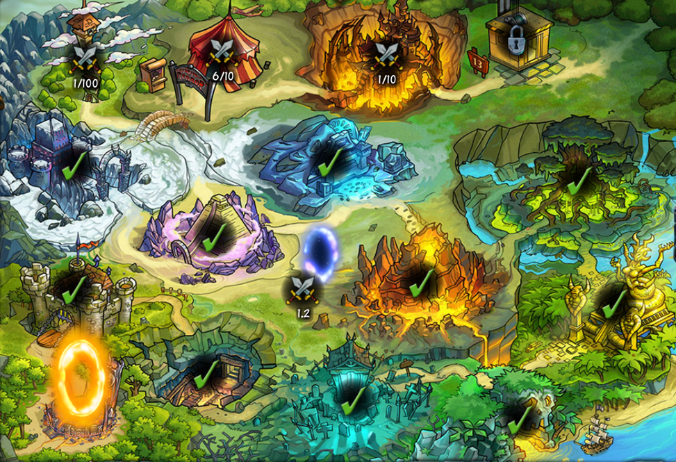

#Dungeons

  </img>

##Normale Dungeons
Ab Stufe 10 kann man alle 10 Level bei Abenteuern einen Dungeon-Schlüssel finden. Dadurch kann man insgesamt 9 Dungeons á 10 Ebenen machen. Jede Stunde kann man eine Ebene betretet, gegen Pilze auch häufiger.

Sobald man eine Ebene geschafft hat, gibt es eine 50% Chance einen Gegenstand zu bekommen. Sobald man den letzten Gegner des Dungeons besiegt bekommt man garantiert einen epischen Gegenstand.

##Extra Dungeons
Sobald man alle 9 Dungeons geschafft hat, werden neue Dungeons freigeschaltet, das Dämonenportal geöffnet und der Turm ist betretbar.

####Dungeons
Es gibt vier neue Dungeons die erst nacheinander freigeschaltet werden. Diese werden automatisch freigeschaltet wenn man den vorherigen Dungeon abgeschlossen hat und man braucht dafür keinen Schlüssel.

####Dämonenportal
Das Dämonenportal kann einmal täglich betreten werden. Der Schaden den man anrichtet wird gespeichert und jeden Tag regeneriert sich das Monster um 10%.

Für jede Ebene die man schafft erhält man 1% mehr Leben.

####Der Turm
Statt einem Dungeon kann man auch den Turm betreten. Hier kämpft man sich durch verschiedene Ebenen wie im Dungeon. Das besondere am Turm ist, dass man Begleiter hat: einen **Magier**, einen **Krieger** und einen **Kundschafter**. Diese kann man ebenfalls ausrüsten, allerdings nicht mit Tränken.

Sobald man eine Ebene schafft bekommt man einen epischen Gegenstand. Dieser kann für jeden der drei Klassen sein.

Um Gegenstände anderer Klassen zu bekommen sollte man [die Toilette](../shakes_and_fidget/level.md) benutzen.
