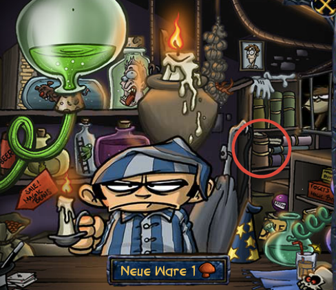
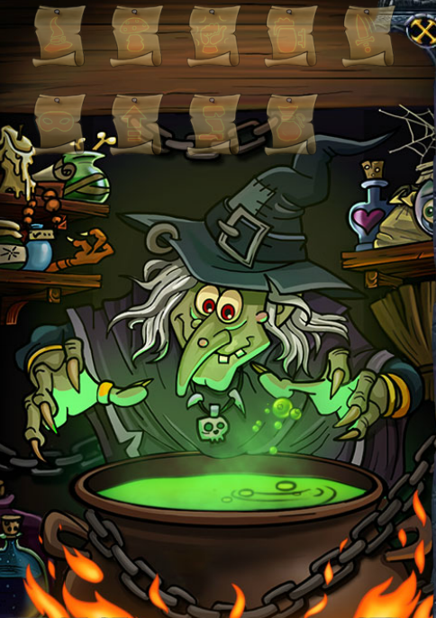

#Levelabhängige Tipps
##Stufe 10
Ab Stufe 10 kann man das [Sammelbuch der Akribie](../shakes_and_fidget/sonstiges.md) im Zauberladen kaufen.

##Stufe 50
####Scherben-Teile
Ab Stufe 50 kann man Scherben-Teile bei Abenteuern finden. Sobald man alle 13 Teile gefunden hat, hat man ein Spiegelbild von sich gemacht und kann neben einem Abenteuer oder der Stadtwache gleichzeitig in die Arena oder in einen Dungeon.

##Stufe 66
####Hexe
Ab Level 66 kann man im Zauberladen das unauffällige Buch anklicken. Dadurch gelangt man zur Hexe, bei der man seine Gegenstände gegen Gold verzaubern.

  </img>

  </img>

Mögliche Verbesserungen:
- **Amulett**: Höhere Chance Gegenstände zu finden (+ 10%)
- **Brustpanzer**: Höhere Chance Pilze zu finden (+ 50%)
- **Handschuhe**: Höherer Reaktionswert, wodurch man eher anfängt
- **Gürtel**: Beim Wirt kann man ein Bier mehr trinken
- **Waffe**: Schaden bei kritischen Treffern wird erhöht (+ 5%)
- **Talisman**: Mehr Gold bei Arena-Siegen (bis zu 20%)
- **Kopfbedeckung**: Zusätzliche Erfahrung bei Abenteuern (+ 10%)
- **Schuhe**: Reisezeit beginnt bei 0:30
- **Ring**: Zusätzliches Gold  bei Abenteuern (+ 10%)

##Level 99
#### Gilden-Portal

Ab Level 99 kann man das Gilden-Portal betreten. Mehr zu lesen unter dem [Gilden Kapitel](shakes_and_fidget/gilde.md).

##Level 100
####Toilettenschlüssel

Den Toilettenschlüssel findet man zufällig in einer Quest sobald man Level 100 erreicht hat. Sobald man diesen hat kann man die Toilette in der Taverne betreten.

  </img>

In die Toilette kann man Gegenstände hineinwerfen und veränderte Gegenstände kommen heraus. Desweiteren füllt sich der _Mana Tank_ um eine bestimmte Menge.
Dabei ist folgendes zu beachten:

- Die Attribute können sich durch die Toilette verändern
- Die Werte auf den Attributen verändern sich nicht
- Ein Gegenstand für eine andere Klasse kann erscheinen
- Man kann jeden Gegenstand nur einmal wiederverwerten
- Sollte man den Gegenstand danach verkaufen, bekommt man dafür kein Gold

Sobald der Füllstand voll ist kann man den Abzug ziehen und bekommt einen epischen Gegenstand.

**Achtung**: Nur einmal am Tag wird der _Mana Tank_ durch den ersten Gegenstand gefüllt. Danach bekommt man nur noch veränderte Gegenstände.
