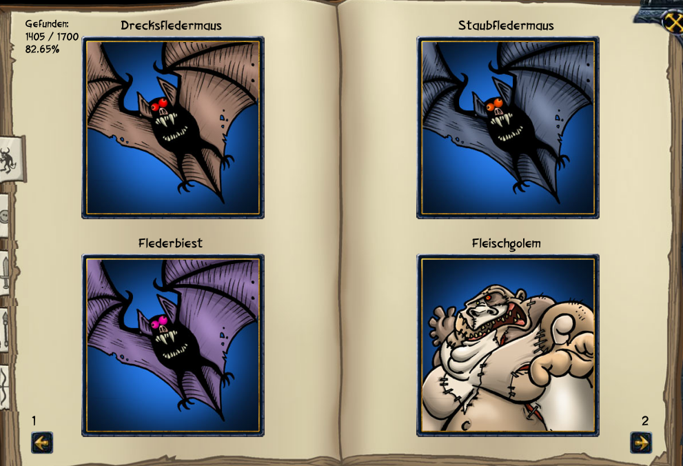

#Sonstiges
##Tränke stapeln
Man kann Tränke stapeln, indem man Tränke einfach hintereinander auf den Charakter zieht. Die Dauer des Trankes erhöht sich dann jeweils um weitere 3 Tage.

##Sammelalbum der Akribie
Ab Stufe 10 ist das Sammelalbum beim Zauberladen zu kaufen. Dieses füllt sich mit Bildern von Gegenständen die man findet und Gegnern die man tötet.

  </img>

Die Prozentanzeige in der oberen Linken Ecke gibt die zusätzliche Erfahrung an die man bei Abenteuern bekommt.

Das Buch kann man füllen über Gegner die man bei Abenteuern bekämpft oder mit Gegnern bei Gildenraids und Dungeons.

Die Gegenstände im Buch werden gefüllt durch Gegenstände die man findet und über die Taverne, indem man Gegner besiegt. Die Gegenstände die diese Person trägt werden einem angerechnet.

Um das Buch zu füllen sollte man in die Ehrenhalle gehen und nach bestimmten Leveln suchen und so fehlende Gegenstände so sammeln. Eine gute Hilfe für Gegenstände ist das [4m7 sammelalbum](http://www.4m7.de/sammelalbum).
